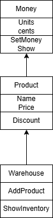

# Лабораторна робота 1

## Тема: Принципи програмування

## Файли
- `Program.cs` — головна програма
- `Money.cs` — клас для представлення грошей
- `Product.cs` — клас товару
- `Warehouse.cs` — клас складу
- `pay.drawio.png` — UML-діаграма
- `README.md` — цей опис

---

## Тестування (завдання 2)

У головному методі `Main()` перевіряється:
- створення обʼєктів `Money`, `Product`, `Warehouse`
- знижка на товар
- вивід інформації у консоль до і після знижки

Це демонструє, що класи комунікують між собою.

[Див. файл Program.cs](./Program.cs)

---

##Дотримання принципів програмування (завдання 3)

### 1. DRY (Don’t Repeat Yourself)
Ми не дублюємо однаковий код. Метод `Show()` виводить ціну — і використовується у кількох класах:
[`Money.cs`](./Money.cs)

---

### 2. KISS (Keep It Simple, Stupid)
Код дуже простий і зрозумілий. Наприклад, клас `Product` має лише назву і ціну — нічого зайвого.
[`Product.cs`](./Product.cs)

---

### 3. SRP (Single Responsibility Principle)
Кожен клас виконує одну задачу:
- `Money` — тільки для роботи з цінами
- `Product` — тільки про товар
- `Warehouse` — тільки про склад
[`Money.cs`, `Product.cs`, `Warehouse.cs`](./)

---

### 4. OCP (Open/Closed Principle)
Класи можна розширити (наприклад, додати нові методи), але не потрібно їх змінювати. Ми могли б зробити `DigitalProduct`, не чіпаючи `Product`.

---

### 5. YAGNI (You Aren’t Gonna Need It)
Ми не додавали нічого зайвого. Лише базовий функціонал: ціна, продукт, склад, знижка.

---

### 6. Composition Over Inheritance
Клас `Product` містить (`has-a`) об’єкт `Money`, а не наслідує від нього:
[`Product.cs`](./Product.cs)

---

### 7. Fail Fast
Ми не дозволяємо ціні стати від’ємною: при знижці використовуємо `Math.Max(0, ...)`.
[`Product.cs`, рядок з `Discount()`](./Product.cs)

---

##UML-діаграма (завдання 4)

Діаграма показує класи `Money`, `Product`, `Warehouse` та звʼязки між ними.

---

## Як запустити

1. Відкрити проєкт у Visual Studio
2. Натиснути **Start** або запустити з `Program.cs`

---

## Посилання на репозиторій

https://github.com/KaminskiiMaxim/KPZ

